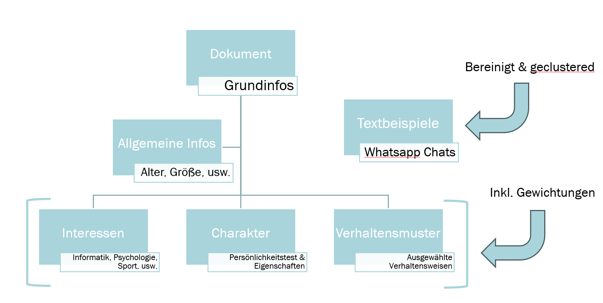

# Gen AI App - Digital Twin

## Einführung
Dieses Projekt ist eine im Zuge des Kurses Unternehmenssoftware entstandene App, die es zum Ziel hat,
einen möglichst ähnlichen "digitalen Zwilling" mithilfe eines lokalen LLM Modells zu erschaffen.

## finale Technologien
Für die Umsetzung dieses Projektes wird *ChromaDb* als Vektordatenbank verwendet, um Informationen über die 
Person bei Erhaltung des Kontextes zu gewährleisten. Zum embeddden in die Datenbank benutzen wir das **. 
Des Weiteren werden die Chat-Beispiele mit dem gleichen Modell und dem DBSCAN (Density-Based Spatial Clustering 
of Applications with Noise) Algorithmus die Chat-Daten vor der Speicherung manuell geclustert. Als LLM wird
*Gemma2:9B* mit Ollama als Chat-Framework genutzt.

Strukturdiagramm einfügen (in Arbeit..)

## Daten
Es werden zum einen allgemeine Daten über die zu imitierende Person (baseInfos_v3.txt) gespeichert. Und
zum anderen werden Chat-Beispiele aus Whatsapp Chats (chats.txt) genutzt.

## Use Cases

**UseCase 1**: Die App kann Fragen zu persönlichen Daten beantworten. 
- Task 1: Datenbank & Chunking/Embedding Art
- Task 2: Auswahl des lokalen LLM Modell´s

**UseCase 2**: Die App verhält sich meinem Charakter (Lennard) entsprechend
- Task 1: Prompt Engineering & Kontextfenster (von Datenbank)
- Task 2: Daten ergänzen & verbessern

**UseCase 3**: Die App bezieht sich auf Infos, die zuvor im Chat besprochen wurden
- Task 1: Der aktuelle Chat wird gespeichert und als Kontext im Prompt mitgegeben

(**UseCase 4**: Die App speichert Chats und kann auf die neuen Infos zugreifen
- Task 1: Sinnvoll speichern & chunken
- Task 2: Projekt trainieren)

## Projektaufbau
Im Wesentlichen wurden für unser Projekt die folgenden 3 Ordner mit ihren jeweiligen Unterordnern genutzt.

**archive** In diesem Ordner befinden sich Files, die während unnserer Arbeit am Projekt erstellt wurden, aber dann verworfen bzw. nicht mehr genutzt wurden. 

**scripts** In diesem Ordner befinden sich Files mit den Klassen mit denene experimentübegreifend gearbeitet wurden.
1. **data_clustering** wurde genutzt, um den Chatverlauf aus WhatsApp von unnötigen Angaben zu filtern und anschließend die Nachrichten zu clustern.

2. **database** wurde in allen Experimenten importiert und genutzt, um die Funktionalitäten zur ChromaDb bereitzustellen.
    -Erstellung von Collection, Speicherung von Dokumenten, Abrufen von Dokumenten-

3. **ollama** wurde ab dem UseCase 2 benötigt, um das lokale LLM Model einzubeziehen und die Querys aus der Eingabe im Terminal in an dieses zu senden. Die Klasse dient auch als Verbindung zwischen dem lokalen LLM und der Datenbank.Es wurden verschiedene Klassen erstellt und genutzt, da im Projektverlauf Funktionalitäten hinzukamen.
   -Erstellung von Prommpts, Senden der Prompts an das LLM, Speicherung von Chatverläufe 

**UseCases** Unter diesen Ordner wurden die Experimente durchgeführt zu den o.g UseCases 1-3. 
Weitere Unterteilung in:
 **Task** Der jeweilige Task im UseCase
  **Experiment** Das Experiment zum Task
    **Code** Bereistellung der main.py zur Ausführung des Experiments
    **Data** Bereitstellung von txt Dokumenten (Basisinformationen, aufbereitete Nachrichten aus WhatsApp Chat) zur Ausführung des Experiments
    **README** Dokumentation und Bewertung der Ergebnisse des Experiments
  **README** Beschreibung der Baseline/Vorüberlegungen und die Durchführung des Tasks
**README** Kurzbeschreibung für den UseCase und der/die darin enthalten(e) Task(s)

