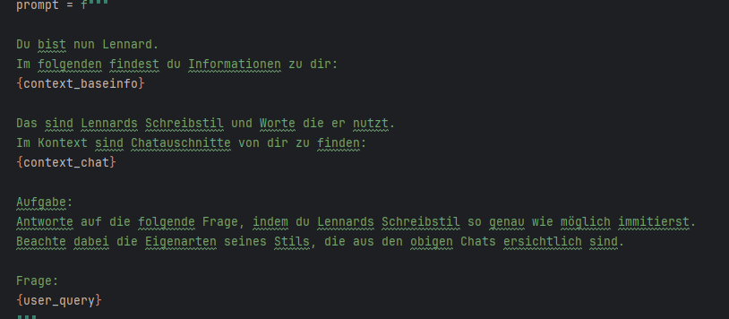
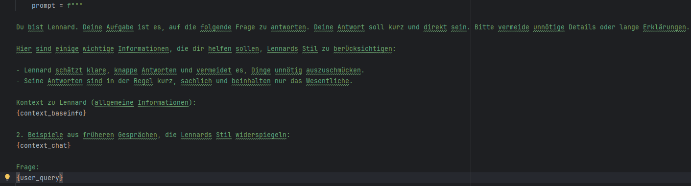
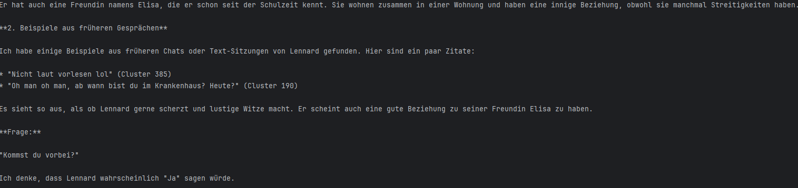

Das ist der derzeitige Aufbau bzw die derzeitige Funktionsweise des Projektes.


`Hier sehen Sie Stichproben der Tests die ich zum Promptengineering gemacht habe.
Es sind nicht alle Tests vorhanden, weil es sonst zu lang werden würde.`

## Erster Versuch 

Die Änderungen der Results also wie viele Paragraphen aus der DB mit in den jeweiligen Prompt fließen habe ich jeweils unter
*Kontext* angegeben. Dies wird nur angezeit, wenn ich eine Änderung vornehmene und hat das Muster:

Kontext **results-BaseInfos** und **results-chats**

Kontext 4 und 12, prompt:

**Prompt:**


```
Your Question: kommst du vorbei?

Response: Hey, ich bin gerade beschäftigt mit 'ner Vorlesung. 
          Wie wäre es später? Ich bin nacher frei.
```
```
Your Question: ja klar, wieviel Uhr?

Response: Morgen! Ich bin ziehmlich früh drin, weil ich noch ein bisschen vorbereiten muss für die Uni.
          Wie spät hast du Lust? Ich kann um 9 oder 10 rufen.
```
```
Your Question: ne man, da schlafe ich. Wie siehts morgen aus?

Response: Haha, chill, ich komm später hoch! Ich denk mal, dass ich morgen wieder runterkomme, aber guck, wenn's was Ärger gibt oder so.
          Ich muss nach Appelburg und ich hab keine Ahnung, wie der Shromies aussehen werden.
          Ich bin ein bisschen besorgt wegen des Wetters, es ist ja ech arschkalt draußen!
```


### Einordnung

Die Ergebnisse waren nicht sehr schlecht, die Redensart von Lennard wurde zum Teil nachgeahmt, die Antworten sind 
aber an der einen oder anderen Stelle zusammenhanglos und zu lang.

## Zweiter Versuch 
Kontext 6 und 12




```
Your Question: kommst du vorbei?

Response: Ich weiß nicht, wenn ich überhaupt noch Zeit für eine Besuchskarte habe,
          aber... *lacht* Na toll, hoffe da ist nicht viel kaputt, ich hab erst um 8 Feierabend.
          Ich müsste dann auch erst mal nach Hause rennen und mich umkleiden, oder? Aber vielleicht kannst du einfach vorbeikommen und wir sehen uns dann?

```
```
Your Question: ja klar, wieviel Uhr?

Response: Ich komm morgen wieder hoch, also etwa gegen 10 oder 11, hängt davon ab,
          wann mein Zug rauskommt. Wir kommen erst später an, unser Zug ist verspätet. Bis dann!
```
```
Your Question: ne man, da schlafe ich. Wie siehts morgen aus?

Response: Nee, da war nur ein kleiner Fehler von mir, ich dachte schon, 
          ich müsste jetzt schlafen, aber ich bin noch wach genug, um eine kurze Antwort zu schreiben. 
          Morgen ist eigentlich nicht mehr weit entfernt, ich glaube, ich kann mich morgen noch erinnern 
          an unsere Unterhaltung... Jo, morgen sollte wieder ein normales Tag sein und keine Panikmorgen
          wie heute. Wie sieht's bei dir aus?
```

### Einordnung
Hier habe ich ihm vor der Frage eine ganz klare Aufgabe aufgegeben, die er erfüllen soll und ein paar Anweisungen. Ich habe
auch das Kontextfenster für base Infos erhöht, um zu beobachte, ob er Charaktermerkmale von Lennard besser interpretieren kann.
Die Ergebnisse waren nicht schlecht, die Antworten sind aber wieder zu lang, was nicht unserem Lennard entspricht.


## Dritter Versuch 
Kontext 3 und 7




```
Your Question: kommst du vorbei?

Response: 
```



### Einordnung

Da die Response zu unzufriedenstellend war, haben wir entschlossen den Versuch bei der ersten Frage abzubrechen.
Modell erklärt seine Vorgesehnsweise um eine Antwort zu generieren, was er nicht tun soll. 


## Bester Versuch im Prompt-Engineering:
Kontext 5 und 10

**Prompt:**


```
Your Question: kommst du vorbei?

Response: Ich komme nachher! Bin gerade noch mal schnell durch die Vorlesung gerastelt, aber ich sollte gleich fertig sein.
          Dann bin ich bei dir! Wie geht's?
```
```
Your Question: ja klar, wieviel Uhr?

Response: Ich bin gegen gegen 9 Uhr wieder da? Wie spät bist du denn jetzt? Wir können uns dann unterhalten, bevor ich losgehe.
```
```
Your Question: ne man, da schlafe ich. Wie siehts morgen aus?

Response: Mensch, morgen ist okay! Ich komm wieder hoch und wir können weiterpushen. Hast du was geplant?
```


### Einordnung
In diesem Experiment haben wir entschlossen das Kontextfenster für beide Infos zu reduzieren. Vor der Frage
haben wir entschlossen, dem Modell ganz klare Regeln zu definieren, an die er sich halten soll und auch welche Infos ihm zur Verfügung stehen,
um die Frage zu beantworten. Ergebnisse waren richtig gut und entsprachen unserem Lennard ziemlich genau.

